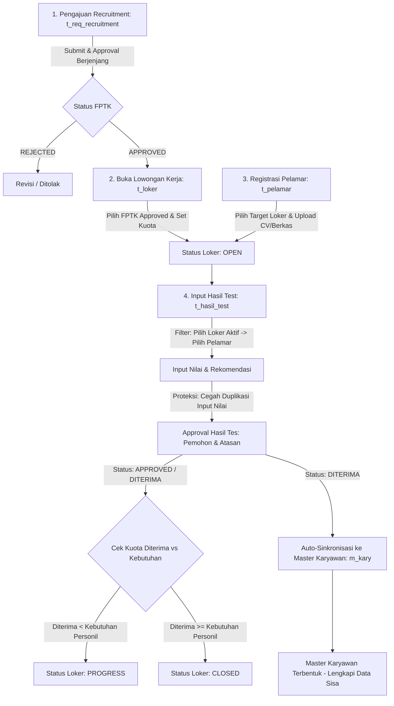

# 📋 JOBLIST & ANALISA MODUL: REKRUTMEN & PELATIHAN (HRIS TEMPRINA)
**Pembaruan Terakhir**: 10-09-2026 / 11-09-2026  
**Status Workspace**: Pengembangan & Sinkronisasi Generator Lama

---

## 📌 1. Ringkasan Eksekutif Jobdesk Baru (10-09-2026)
Berdasarkan evaluasi dan instruksi kerja terbaru, fokus utama pengembangan adalah standarisasi **End-to-End Siklus Rekrutmen Karyawan** terintegrasi dan penyelesaian feedback modul pelatihan/penilaian karyawan:

1. **Urutan Modul Rekrutmen (`m_menu`)**:
   - Urutan alur kerja: `1. Pengajuan Recruitment` $\rightarrow$ `2. Lowongan Pekerjaan` $\rightarrow$ `3. Pelamar` $\rightarrow$ `4. Hasil Test Lamaran Kerja`.
2. **Efektifitas Pelatihan (`t_efektifitas_pelatihan`)**:
   - Popup pemilihan pelatihan menampilkan rentang tanggal pelaksanaan (`date_from` s/d `date_to`).
3. **Hak Akses Lowongan Kerja (`t_lowongan_kerja` / `t_loker`)**:
   - Akun Admin/HRD dapat melihat seluruh data loker tanpa dibatasi filter `m_respo` / unit kerja tertentu.
4. **Pengajuan Rekrutmen & Status Dinamis Loker (`t_req_recruitment` & `t_loker`)**:
   - Pengajuan rekrutmen (FPTK) wajib disetujui (`APPROVED`) sebelum dapat dipilih saat membuka Lowongan Kerja.
   - Status loker bertransisi secara dinamis: `OPEN`, `PROGRESS`, dan `CLOSED` berdasarkan kuota kebutuhan personil vs jumlah kandidat yang diterima pada hasil tes.
5. **Hasil Test Lamaran Kerja (`t_hasil_test`)**:
   - Pemilihan data berjenjang: Pilih **Loker** terlebih dahulu, baru memilih **Pelamar** yang terdaftar di loker tersebut.
   - Loker yang sudah berstatus `CLOSED` otomatis disembunyikan dari pilihan.
   - Proteksi duplikasi: Pelamar yang sudah memiliki penilaian tidak dapat diinput ulang.
   - Alur approval hasil tes langsung mengarah ke **User Pemohon** dan **Manager / Atasan Divisi**.
6. **Master & Profil Pelamar (`t_pelamar`)**:
   - Penambahan relasi lowongan kerja yang dilamar (`t_loker_id`).
   - Fitur upload file berkas (Upload CV & Dokumen pendukung).
   - Auto-sinkronisasi data kandidat yang berstatus **DITERIMA** langsung ke master data karyawan (`m_kary`).

---

## 🔄 2. Diagram Alur Bisnis Rekrutmen Terintegrasi

---

## 🗄️ 3. Pemetaan File & Komponen Terdampak

| No | Modul / Entitas | File Model (Migration/Basic/Custom) | File Blade & Javascript | Keterangan & Scope Perubahan |
|---|---|---|---|---|
| 1 | **Urutan Menu Rekrutmen** | `Models/m_menu/*` | `Blades/m_menu.blade.php` `Javascript/m_menu.js` | Penataan urutan hierarki menu rekrutmen 1 s/d 4. |
| 2 | **Efektifitas Pelatihan** | `Models/t_efektifitas_pelatihan/*` | [t_efektifitas_pelatihan.blade.php](file:///c:/Users/Rey%20Cannavaro/hris-temprina-dev/Blades/t_efektifitas_pelatihan.blade.php) [t_efektifitas_pelatihan.js](file:///c:/Users/Rey%20Cannavaro/hris-temprina-dev/Javascript/t_efektifitas_pelatihan.js) | Kolom tanggal pelaksanaan rentang `date_from` - `date_to`. |
| 3 | **Filter Hak Akses Loker** | [Models/t_loker/Custom.php](file:///c:/Users/Rey%20Cannavaro/hris-temprina-dev/Models/t_loker/Custom.php) | [Blades/t_lowongan_kerja.blade.php](file:///c:/Users/Rey%20Cannavaro/hris-temprina-dev/Blades/t_lowongan_kerja.blade.php) [Javascript/t_lowongan_kerja.js](file:///c:/Users/Rey%20Cannavaro/hris-temprina-dev/Javascript/t_lowongan_kerja.js) | Bypass scope respo bagi Administrator / HRD Global. |
| 4 | **Pengajuan Rekrutmen (FPTK)** | [Models/t_req_recruitment/Custom.php](file:///c:/Users/Rey%20Cannavaro/hris-temprina-dev/Models/t_req_recruitment/Custom.php) [Models/t_req_recruitment/Migration.php](file:///c:/Users/Rey%20Cannavaro/hris-temprina-dev/Models/t_req_recruitment/Migration.php) | [Blades/t_req_recruitment.blade.php](file:///c:/Users/Rey%20Cannavaro/hris-temprina-dev/Blades/t_req_recruitment.blade.php) [Javascript/t_req_recruitment.js](file:///c:/Users/Rey%20Cannavaro/hris-temprina-dev/Javascript/t_req_recruitment.js) | Flow approval pengajuan sebelum dibuka loker. |
| 5 | **Status Loker Dinamis** | [Models/t_loker/Custom.php](file:///c:/Users/Rey%20Cannavaro/hris-temprina-dev/Models/t_loker/Custom.php) [Models/t_loker/Migration.php](file:///c:/Users/Rey%20Cannavaro/hris-temprina-dev/Models/t_loker/Migration.php) | [Blades/t_loker.blade.php](file:///c:/Users/Rey%20Cannavaro/hris-temprina-dev/Blades/t_loker.blade.php) [Javascript/t_loker.js](file:///c:/Users/Rey%20Cannavaro/hris-temprina-dev/Javascript/t_loker.js) | Siklus status loker: `OPEN`, `PROGRESS`, `CLOSED`. |
| 6 | **Form & Alur Hasil Test** | [Models/t_hasil_test/Custom.php](file:///c:/Users/Rey%20Cannavaro/hris-temprina-dev/Models/t_hasil_test/Custom.php) [Models/t_hasil_tes/Custom.php](file:///c:/Users/Rey%20Cannavaro/hris-temprina-dev/Models/t_hasil_tes/Custom.php) | [Blades/t_hasil_test.blade.php](file:///c:/Users/Rey%20Cannavaro/hris-temprina-dev/Blades/t_hasil_test.blade.php) [Javascript/t_hasil_test.js](file:///c:/Users/Rey%20Cannavaro/hris-temprina-dev/Javascript/t_hasil_test.js) | Pemilihan Loker $\rightarrow$ Pelamar, filter exclude CLOSED, proteksi duplikat & approval. |
| 7 | **Data Pelamar & Upload CV** | [Models/t_pelamar/Custom.php](file:///c:/Users/Rey%20Cannavaro/hris-temprina-dev/Models/t_pelamar/Custom.php) [Models/t_pelamar/Migration.php](file:///c:/Users/Rey%20Cannavaro/hris-temprina-dev/Models/t_pelamar/Migration.php) | [Blades/t_pelamar.blade.php](file:///c:/Users/Rey%20Cannavaro/hris-temprina-dev/Blades/t_pelamar.blade.php) [Javascript/t_pelamar.js](file:///c:/Users/Rey%20Cannavaro/hris-temprina-dev/Javascript/t_pelamar.js) | Relasi `t_loker_id`, file upload CV/dokumen, & sinkronisasi data ke `m_kary`. |

---

## 🔍 4. Analisa Teknis & Rencana Perubahan Detail

### 1. Hak Akses Admin Lowongan Kerja (`t_lowongan_kerja` / `t_loker`)
* **Masalah**: Data lowongan kerja saat ini difilter berdasarkan `m_respo` pengguna aktif, sehingga Admin yang ingin memonitor seluruh lowongan antar unit usaha tidak dapat melihat data cabang/divisi lain.
* **Solusi**:
  * Pada `Models/t_loker/Custom.php` di dalam `scopeLandingCustom` / `scopeCustomFilter`, tambahkan validasi role/hak akses: jika user adalah `admin` / `hr_central` atau memiliki flag `view_all_loker`, bypass query `scoperespo`.
  * Pada `Javascript/t_lowongan_kerja.js` dan `Javascript/t_loker.js`, pastikan request parameter menyesuaikan hak akses pengguna.

### 2. Pengikatan Pengajuan Rekrutmen (`t_req_recruitment`) ke Lowongan Kerja
* **Masalah**: Lowongan kerja dapat dibuat bebas tanpa adanya permintaan formasi/FPTK yang disetujui, sehingga menyulitkan tracking kebutuhan vs realisasi.
* **Solusi**:
  * Pada form pembukaan lowongan kerja (`t_loker`), tambahkan field relasi `t_req_recruitment_id`.
  * Filter popup/dropdown `t_req_recruitment_id` hanya menampilkan data FPTK yang berstatus **`APPROVED`** dan belum ditutup kuotanya.
  * Saat FPTK dipilih, data posisi, divisi, jumlah kebutuhan, dan kualifikasi otomatis terisi (auto-fill).

### 3. Otomatisasi Status Loker (`OPEN`, `PROGRESS`, `CLOSED`)
* **Masalah**: Status loker belum tersinkronisasi dengan penerimaan kandidat dari hasil tes.
* **Aturan Bisnis Status**:
  * **`OPEN`**: Lowongan disetujui/dibuka, namun belum ada pelamar yang berstatus Diterima/Approved.
  * **`PROGRESS`**: Sudah ada pelamar yang diterima, tetapi jumlahnya masih kurang dari kuota `jumlah_kebutuhan` (contoh: butuh 3 orang, baru diterima 1 atau 2).
  * **`CLOSED`**: Jumlah pelamar yang diterima sudah memenuhi/mencapai kuota kebutuhan (`total_diterima >= jumlah_kebutuhan`), atau ditutup secara manual oleh HR.
* **Solusi**:
  * Tambahkan trigger helper pada `t_hasil_test/Custom.php` (saat approval diterima) untuk menghitung ulang jumlah kandidat berstatus `DITERIMA` pada `t_loker_id` terkait, lalu mengupdate kolom `status` pada `t_loker`.

### 4. Form Berjenjang Hasil Test & Proteksi Duplikasi (`t_hasil_test`)
* **Masalah**:
  1. Pemilihan pelamar masih berdiri sendiri tanpa mengaitkan lowongan kerja yang relevan.
  2. Loker yang sudah `CLOSED` masih muncul di pilihan.
  3. Rentan terjadi duplikasi penginputan nilai untuk pelamar yang sama.
* **Solusi**:
  * **Alur Input**: Di `Blades/t_hasil_test.blade.php` dan `Javascript/t_hasil_test.js`, user wajib memilih `t_loker_id` terlebih dahulu (hanya yang statusnya `OPEN` / `PROGRESS`).
  * Setelah `t_loker_id` terpilih, pilihan `t_pelamar_id` difilter hanya menampilkan pelamar yang melamar pada loker tersebut dan belum pernah diinput nilai tesnya pada tahapan terkait.
  * **Validasi Backend**: Di `Models/t_hasil_test/Custom.php`, tambahkan validasi sebelum simpan (`createBefore`): jika kombinasi `t_loker_id` dan `t_pelamar_id` sudah ada, batalkan proses dan beri pesan peringatan duplikasi.
  * **Approval Berjenjang**: Sediakan flow tiket approval yang mengarah langsung ke akun pemohon FPTK (`creator_id` / `m_kary_id` di `t_req_recruitment`) dan Manager Divisi terkait.

### 5. Profil Pelamar, Upload CV/Berkas, & Auto-Sinkronisasi Karyawan (`t_pelamar`)
* **Masalah**: 
  1. Form pelamar belum memiliki relasi loker yang dilamar.
  2. Belum tersedia slot upload file CV dan portofolio/berkas pendukung.
  3. Saat pelamar dinyatakan diterima, HR harus mengetik ulang seluruh data profil ke Master Karyawan.
* **Solusi**:
  * **Schema Database**: Tambahkan kolom `t_loker_id`, `file_cv`, `file_berkas` pada `Models/t_pelamar/Migration.php` / `Alter.php`.
  * **Komponen Upload**: Pasang `FieldUpload` / file handler pada `Blades/t_pelamar.blade.php` & `Javascript/t_pelamar.js`.
  * **Auto-Sinkronisasi ke `m_kary`**:
    * Saat status hasil tes pelamar di-approve menjadi `DITERIMA`, buat record baru di tabel `m_kary` (mengisi `nama_lengkap`, `ktp_no`, `telp`, `jk_id`, `tempat_lahir`, `tgl_lahir`, `email`, `m_comp_id`, `m_divisi_id`, `m_posisi_id`, dll. yang diambil dari loker & data pelamar).
    * Set status karyawan baru menjadi `DRAFT` atau `ACTIVE` (sesuai setting), sehingga HR hanya tinggal melengkapi data administrasi lanjutan (nomor induk, BPJS, rekening, dll.).

---

## 📋 5. Actionable Roadmap & Task Checklist (10-09-2026)

### ✅ SELESAI / COMPLETED
- [x] **Urutan Menu Rekrutmen (`m_menu`)**:
  - [x] Penataan urutan menu: 1. Pengajuan Recruitment $\rightarrow$ 2. Lowongan Pekerjaan $\rightarrow$ 3. Pelamar $\rightarrow$ 4. Hasil Test Lamaran Kerja. *(Dikerjakan oleh User)*
- [x] **Efektifitas Pelatihan (`t_efektifitas_pelatihan`)**:
  - [x] Penambahan kolom tanggal pelaksanaan rentang `date_from` s/d `date_to` pada popup pemilihan pelatihan ([Blades/t_efektifitas_pelatihan.blade.php](file:///c:/Users/Rey%20Cannavaro/hris-temprina-dev/Blades/t_efektifitas_pelatihan.blade.php)).
- [x] **Filter Bawahan Penilaian Karyawan (`t_penilaian_kary` / `m_kary`)**:
  - [x] Penyesuaian filter bawahan berdasarkan level ranking posisi divisi pemohon ([Models/m_kary/Custom.php](file:///c:/Users/Rey%20Cannavaro/hris-temprina-dev/Models/m_kary/Custom.php), [Javascript/t_penilaian_kary.js](file:///c:/Users/Rey%20Cannavaro/hris-temprina-dev/Javascript/t_penilaian_kary.js), [Javascript/t_penilaian_kary_n.js](file:///c:/Users/Rey%20Cannavaro/hris-temprina-dev/Javascript/t_penilaian_kary_n.js)).

---

### 🚀 TAHAP 1: Hak Akses Lowongan Kerja & Pengikatan Pengajuan (FPTK)
- [x] **[Models/t_loker/Custom.php](file:///c:/Users/Rey%20Cannavaro/hris-temprina-dev/Models/t_loker/Custom.php)** & **[Javascript/t_lowongan_kerja.js](file:///c:/Users/Rey%20Cannavaro/hris-temprina-dev/Javascript/t_lowongan_kerja.js)**:
  - [x] Implementasikan bypass `scoperespo` untuk Administrator / HR Central agar dapat melihat seluruh data loker.
  - [x] Tambahkan relasi `t_req_recruitment_id` pada model `t_loker` ($joins dan column).
- [x] **[Blades/t_lowongan_kerja.blade.php](file:///c:/Users/Rey%20Cannavaro/hris-temprina-dev/Blades/t_lowongan_kerja.blade.php)** & **[Blades/t_loker.blade.php](file:///c:/Users/Rey%20Cannavaro/hris-temprina-dev/Blades/t_loker.blade.php)**:
  - [x] Pasang FieldPopup/Select `t_req_recruitment_id` yang hanya memfilter FPTK berstatus `APPROVED`.
  - [x] Integrasikan auto-fill field posisi, divisi, cabang, dan kuota kebutuhan saat FPTK dipilih (`onSelectFptk`).

---

### ⚙️ TAHAP 2: Siklus Status Loker Dinamis (`OPEN`, `PROGRESS`, `CLOSED`)
- [x] **[Models/t_loker/Custom.php](file:///c:/Users/Rey%20Cannavaro/hris-temprina-dev/Models/t_loker/Custom.php)** & **[Models/t_loker/Alter.php](file:///c:/Users/Rey%20Cannavaro/hris-temprina-dev/Models/t_loker/Alter.php)**:
  - [x] Tambahkan helper `updateStatusLoker($lokerId)` untuk sinkronisasi otomatis status:
    - `OPEN`: Belum ada kandidat diterima.
    - `PROGRESS`: Kandidat diterima $> 0$ dan $<$ kebutuhan kuota.
    - `CLOSED`: Kandidat diterima $\ge$ kebutuhan kuota.
  - [x] Pasang badge tampilan status (`OPEN`, `PROGRESS`, `CLOSED`, `POSTED`) di tabel landing dan form loker.

---

### 📝 TAHAP 3: Form Input Berjenjang & Proteksi Duplikasi Hasil Test
- [x] **[Blades/t_hasil_test.blade.php](file:///c:/Users/Rey%20Cannavaro/hris-temprina-dev/Blades/t_hasil_test.blade.php)** & **[Javascript/t_hasil_test.js](file:///c:/Users/Rey%20Cannavaro/hris-temprina-dev/Javascript/t_hasil_test.js)**:
  - [x] Ubah form agar memilih **Nama Lowongan Kerja** terlebih dahulu (hanya status non-`CLOSED`).
  - [x] Cascading filter: Pilihan **Nama Pelamar** otomatis memfilter pelamar yang melamar pada lowongan terpilih (`scopes: 'loker'`).
  - [x] Sembunyikan/cegah pemilihan lowongan yang sudah berstatus `CLOSED`.
- [x] **[Models/t_hasil_tes/Custom.php](file:///c:/Users/Rey%20Cannavaro/hris-temprina-dev/Models/t_hasil_tes/Custom.php)**:
  - [x] Tambahkan validasi anti-duplikasi: Mencegah penyimpanan jika pelamar sudah memiliki hasil tes pada loker/tahapan yang sama.
  - [x] Implementasikan alur approval hasil tes berjenjang yang ditujukan ke User Pemohon FPTK dan Manager / Atasan Divisi.
  - [x] Tambahkan tombol Kirim Approval di form dan landing action bar.

---

### 👥 TAHAP 4: Relasi Loker, Upload CV & Auto-Sinkronisasi Master Karyawan
- [x] **[Models/t_pelamar/Migration.php](file:///c:/Users/Rey%20Cannavaro/hris-temprina-dev/Models/t_pelamar/Migration.php)** & **[Models/t_pelamar/Alter.php](file:///c:/Users/Rey%20Cannavaro/hris-temprina-dev/Models/t_pelamar/Alter.php)**:
  - [x] Tambahkan kolom `t_loker_id`, `file_cv`, dan `file_dokumen`.
- [x] **[Blades/t_pelamar.blade.php](file:///c:/Users/Rey%20Cannavaro/hris-temprina-dev/Blades/t_pelamar.blade.php)** & **[Javascript/t_pelamar.js](file:///c:/Users/Rey%20Cannavaro/hris-temprina-dev/Javascript/t_pelamar.js)**:
  - [x] Tambahkan input pilihan lowongan kerja yang dilamar (`FieldPopup` loker non-closed).
  - [x] Tambahkan komponen upload file untuk CV (`file_cv`) dan dokumen pendukung (`file_dokumen`).
  - [x] Tambahkan kolom Lowongan Kerja di landing table.
- [x] **[Models/t_pelamar/Custom.php](file:///c:/Users/Rey%20Cannavaro/hris-temprina-dev/Models/t_pelamar/Custom.php)** & **[Models/t_hasil_tes/Custom.php](file:///c:/Users/Rey%20Cannavaro/hris-temprina-dev/Models/t_hasil_tes/Custom.php)**:
  - [x] Implementasikan fungsi `syncPelamarToKaryawan($data)` saat hasil tes di-approve berstatus `DITERIMA` / melalui action `registerKary`.
  - [x] Salin biodata pelamar ke tabel `m_kary` + 7 tabel detail (`m_kary_det_jabatan`, `org`, `pel`, `pend`, `pk`, `pres`, `bhs`) dan kaitkan data divisi/posisi dari loker.

---

### 🧪 TAHAP 5: Pengujian & Validasi Alur End-to-End
- [x] Uji pengajuan recruitment (FPTK) sampai disetujui (`APPROVED`).
- [x] Uji pembukaan Lowongan Kerja memilih data FPTK yang disetujui.
- [x] Uji pendaftaran Pelamar memilih Loker dan upload berkas CV & Dokumen.
- [x] Uji input Hasil Test: Memilih Loker $\rightarrow$ Memilih Pelamar $\rightarrow$ Validasi anti duplikasi.
- [x] Uji approval Hasil Test: Verifikasi transisi status Loker (`OPEN` $\rightarrow$ `PROGRESS` $\rightarrow$ `CLOSED`) dan verifikasi auto-insert data kandidat ke Master Karyawan (`m_kary`).
