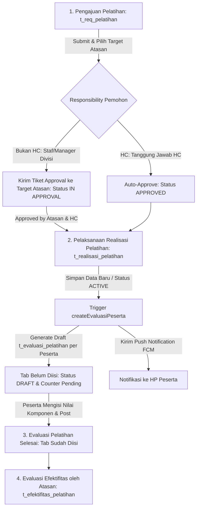

# 🎓 JOBLIST & ANALISA MODUL: PELATIHAN KARYAWAN (HRIS TEMPRINA)
Diperbarui: 2026-08-31

---

## 📌 6. Ringkasan Eksekutif Modul Pelatihan
Modul **Pelatihan Karyawan** di HRIS Temprina mengelola siklus pelatihan secara terintegrasi:
1. **Pengajuan Pelatihan (`t_request_pelatihan` / `t_req_pelatihan`)**: Pengajuan kebutuhan pelatihan oleh divisi atau HC, dilengkapi alur approval berjenjang ke atasan pemohon.
2. **Realisasi Pelatihan (`t_realisasi_pelatihan`)**: Pencatatan pelaksanaan aktual pelatihan, trainer, sarana, dan daftar peserta karyawan (`t_realisasi_pelatihan_d_kary`) dengan status `ACTIVE` / `INACTIVE`.
3. **Evaluasi Pelatihan (`t_evaluasi_pelatihan`)**: Penilaian pelatihan oleh peserta yang otomatis digenerate draft-nya saat realisasi berstatus `ACTIVE` beserta push notifikasi ke HP/device peserta.
4. **Efektifitas Pelatihan (`t_efektifitas_pelatihan`)**: Evaluasi pasca pelatihan oleh atasan peserta untuk mengukur dampak pelatihan terhadap kinerja.

---

## 🔄 7. Alur Bisnis Pelatihan & Evaluasi Peserta

---

## 🗄️ 8. Pemetaan File & Model Terkait Modul Pelatihan

| No | Layer / Entitas | File Model (Migration/Basic/Custom) | File Blade & Javascript | Deskripsi Fungsi |
|---|---|---|---|---|
| 1 | **Master Program Pelatihan** | `Models/m_prog_pelatihan/*` `Models/m_prog_pelatihan_d_divisi/*` `Models/m_prog_pelatihan_d_level/*` | `Blades/m_prog_pelatihan.blade.php` `Javascript/m_prog_pelatihan.js` | Master tema & kurikulum pelatihan |
| 2 | **Master Trainer** | `Models/m_trainer/*` | `Blades/m_trainer.blade.php` `Javascript/m_trainer.js` | Master pengajar/instruktur |
| 3 | **Pengajuan Pelatihan** | `Models/t_request_pelatihan/*` `Models/t_request_pelatihan_d_kary/*` | `Blades/t_req_pelatihan.blade.php` `Javascript/t_req_pelatihan.js` | Transaksi pengajuan kebutuhan pelatihan |
| 4 | **Realisasi Pelatihan** | `Models/t_realisasi_pelatihan/*` `Models/t_realisasi_pelatihan_d_kary/*` | `Blades/t_realisasi_pelatihan.blade.php` `Javascript/t_realisasi_pelatihan.js` | Realisasi jadwal, trainer, & peserta aktif |
| 5 | **Evaluasi Pelatihan** | `Models/t_evaluasi_pelatihan/*` `Models/t_evaluasi_pelatihan_detail/*` | `Blades/t_evaluasi_pelatihan.blade.php` `Javascript/t_evaluasi_pelatihan.js` | Penilaian pelatihan oleh masing-masing peserta |
| 6 | **Efektifitas Pelatihan** | `Models/t_efektifitas_pelatihan/*` `Models/t_efektifitas_pelatihan_detail/*` | `Blades/t_efektifitas_pelatihan.blade.php` `Javascript/t_efektifitas_pelatihan.js` | Evaluasi dampak pelatihan oleh atasan |

---

## 🔍 9. Analisa Temuan Masalah & Bug Feedback Klien

### 1. Bug Auto-Approve HC Keliru pada Pengajuan Pelatihan (`t_request_pelatihan` / `t_req_pelatihan`)
- **Penyebab**: 
  - Di `Models/t_request_pelatihan/Custom.php` baris 180, penentuan `$is_hc` mencakup `user_type == 'admin'`, atau username `developer` / `danvers`, serta membaca atribut global tanpa memvalidasi **responsibility yang sedang aktif**.
  - Jika seorang staf atau akun testing mengajukan pelatihan dan memilih target approval manager divisinya, sistem malah mengeksekusi blok auto-approve HC (`APPROVED AUTO BY HC`), memotong flow approval normal.
  - Di `Blades/t_req_pelatihan.blade.php` dan `Javascript/t_req_pelatihan.js` juga terdapat hardcode `isUserHC` serupa.
- **Solusi**:
  - Validasi responsibility aktif pemohon melalui `getCore('Respo')->checkRespoActive()` dan periksa apakah responsibility yang aktif benar-benar memiliki tanggung jawab HC.
  - Jika responsibility pemohon bukan HC, wajib menjalankan alur approval berjenjang normal: membuat tiket approval ke target atasan (`target_id` / manager divisi), mengubah status menjadi `IN APPROVAL`, dan mengirim push notifikasi FCM ke target atasan.

### 2. Trigger Pembuatan Draft Evaluasi & Notifikasi saat Realisasi Pelatihan Dibuat / Status `ACTIVE`
- **Penyebab**:
  - Modul `t_realisasi_pelatihan` tidak menggunakan siklus DRAFT/POST, melainkan `ACTIVE` / `INACTIVE`.
  - Saat ini, method `createEvaluasiPeserta($data)` hanya dipanggil pada `custom_posted`, `custom_progress`, dan `custom_approveHC`. Saat data baru disimpan atau diupdate menjadi `ACTIVE` via `createAfter` / `updateAfter`, pembuatan draft evaluasi **belum terpanggil**.
- **Solusi**:
  - Tambahkan hook di `createAfter` dan `updateAfter` pada `Models/t_realisasi_pelatihan/Custom.php` untuk memanggil `createEvaluasiPeserta($model)` apabila status data bernilai `ACTIVE`.
  - Pastikan setiap peserta di `t_realisasi_pelatihan_d_kary` dibuatkan header `t_evaluasi_pelatihan` dengan status `DRAFT` dan menerima push notification FCM.

### 3. Fallback Pemuatan Komponen Pertanyaan Evaluasi di Frontend (`t_evaluasi_pelatihan.js`)
- **Penyebab**:
  - Ketika peserta membuka draft evaluasi via tombol pensil "Isi Evaluasi" (`t_evaluasi_pelatihan/{id}?action=Edit`), route berstatus `isRead = true`.
  - Pada `isRead = true`, kode hanya membaca detail dari database. Karena draft auto-generated baru berisi header, `t_evaluasi_pelatihan_detail` masih bernilai kosong (`[]`), dan `loadTipePenilaian()` tidak terpanggil sehingga pertanyaan penilaian tidak tampil.
- **Solusi**:
  - Tambahkan fallback di `loadData()` pada `Javascript/t_evaluasi_pelatihan.js`: jika `initialValues.t_evaluasi_pelatihan_detail` kosong, panggil `loadTipePenilaian()` dari `m_general` agar daftar pertanyaan evaluasi langsung ter-render.

---

## 📋 10. Actionable Roadmap & Task Checklist Pelatihan

### 🚀 TAHAP 6: Perbaikan Otorisasi & Alur Approval Pengajuan Pelatihan
- [x] **[Models/t_request_pelatihan/Custom.php](file:///c:/Users/Rey%20Cannavaro/hris-temprina-dev/Models/t_request_pelatihan/Custom.php)**:
  - Validasi responsibility aktif pemohon (`checkRespoActive()` & respo role HC).
  - Hapus hardcode auto-approve untuk akun admin/developer non-HC.
  - Pastikan pengajuan dari akun non-HC membuat tiket approval ke `target_id` atasan dan mengupdate status ke `IN APPROVAL`.
- [x] **[Blades/t_req_pelatihan.blade.php](file:///c:/Users/Rey%20Cannavaro/hris-temprina-dev/Blades/t_req_pelatihan.blade.php)** & **[Javascript/t_req_pelatihan.js](file:///c:/Users/Rey%20Cannavaro/hris-temprina-dev/Javascript/t_req_pelatihan.js)**:
  - Bersihkan hardcode `isUserHC` agar FieldSelect target approver tetap tampil bagi user non-HC.

### 📦 TAHAP 7: Trigger Evaluasi & Notifikasi saat Realisasi Pelatihan Berstatus `ACTIVE`
- [x] **[Models/t_realisasi_pelatihan/Custom.php](file:///c:/Users/Rey%20Cannavaro/hris-temprina-dev/Models/t_realisasi_pelatihan/Custom.php)**:
  - Tambahkan hook `createAfter()` dan `updateAfter()` yang memicu `createEvaluasiPeserta()` saat status adalah `ACTIVE`.
  - Pastikan `createEvaluasiPeserta()` membuat draft `t_evaluasi_pelatihan` (status `DRAFT`) untuk seluruh peserta di `t_realisasi_pelatihan_d_kary`.
  - Pastikan pengiriman push notifikasi FCM (`sendEvaluasiNotification`) terkirim ke masing-masing akun peserta.

### 📝 TAHAP 8: Sinkronisasi Form & Landing Page Evaluasi Pelatihan
- [x] **[Javascript/t_evaluasi_pelatihan.js](file:///c:/Users/Rey%20Cannavaro/hris-temprina-dev/Javascript/t_evaluasi_pelatihan.js)**:
  - Tambahkan fallback pemanggilan `loadTipePenilaian()` di `loadData()` jika detail draft masih kosong.
  - Pastikan counter `pendingCount` pada tab "Belum Diisi" merefleksikan jumlah evaluasi berstatus `DRAFT` peserta.

### ✅ TAHAP 9: Pengujian & Validasi End-to-End Pelatihan
- [x] Uji pengajuan pelatihan oleh akun staf ke Manager Divisi: verifikasi status menjadi `IN APPROVAL` dan tiket approval terbentuk.
- [x] Uji pengajuan pelatihan oleh akun dengan responsibility HC: verifikasi auto-approve hanya terjadi untuk HC.
- [x] Uji pembuatan Realisasi Pelatihan berstatus `ACTIVE`: verifikasi draft evaluasi terbentuk untuk semua peserta di `t_realisasi_pelatihan_d_kary` dan notifikasi terkirim.
- [x] Uji pengisian evaluasi oleh peserta pelatihan dari tab "Belum Diisi" hingga tersimpan dan berpindah ke tab "Sudah Diisi".
- [x] Uji sinkronisasi dan isolasi tiket notifikasi di `/notifikasi` per akun peserta.

---

# 📋 JOBLIST & ANALISA FEEDBACK KLIEN (03-09-2026)
Diperbarui: 2026-09-03

---

## 📌 11. Ringkasan Eksekutif Feedback & Request Baru
Berdasarkan hasil meeting bersama klien tanggal 03 September 2026, terdapat 5 modul utama yang memperoleh catatan perbaikan serta penambahan fitur baru:
1. **Perjalanan Dinas (`t_perdin`)**: Reset penomoran surat tugas/perdin setiap pergantian hari.
2. **Penilaian Karyawan (`t_penilaian_kary`)**: Otomatisasi filter pilihan karyawan agar atasan hanya dapat menilai bawahan langsungnya dalam lingkup divisi terkait.
3. **Pengajuan Pelatihan (`t_req_pelatihan`)**: Penambahan template dan tombol cetak/printout surat pengajuan pelatihan serta perbaikan label form menjadi "Form Pengajuan Pelatihan".
4. **Efektivitas Pelatihan (`t_efektifitas_pelatihan`)**: Pembatasan pengisian efektivitas hanya 1 kali per peserta yang sudah terposting (tidak muncul lagi saat buat data baru), serta penambahan info daftar peserta yang perlu dinilai saat memilih pelatihan.
5. **Lowongan Kerja & Rekrutmen (`t_lowongan_kerja`, `t_pengajuan_pekerjaan`, `t_hasil_tes`)**: 
   - Perbaikan data lowongan baru agar langsung muncul di landing page.
   - Penambahan alur transaksi pengajuan permintaan karyawan (FPTK) dengan alur approval sebelum pembukaan loker.
   - Standardisasi status proses/diterima/tidak diterima dan 7 tahapan seleksi.
   - Pilihan dropdown nama tes (psikotes, tes tulis, wawancara).
   - Penambahan printout hasil tes lamaran kerja.

---

## 🗄️ 12. Pemetaan File & Rincian Teknis per Modul

| No | Modul / Fitur | File Terdampak | Status Kesiapan Berkas | Deskripsi Rencana Perubahan |
|---|---|---|---|---|
| 1 | **Reset Nomor Surat Perdin** | `Models/t_perdin/Custom.php` `Cores/Helper.php` | ✅ Siap | Menambahkan parameter/tipe reset harian (daily reset) pada fungsi `generateNomor` atau isolasi query counter tanggal berjalan di `t_perdin`. |
| 2 | **Filter Bawahan Penilaian** | `Javascript/t_penilaian_kary.js` `Blades/t_penilaian_kary.blade.php` `Models/m_kary/Custom.php` `Models/t_assessment_kary/Custom.php` | ✅ Siap | Mengintegrasikan `scopeBawahan` atau parameter atasan & divisi aktif pemohon pada `FieldPopupTable` pemilih karyawan. |
| 3 | **Printout Pengajuan Pelatihan** | `Blades/web_report_req_pelatihan.blade.php` `Javascript/t_req_pelatihan.js` `Blades/t_req_pelatihan.blade.php` | 📝 Berkas dibuat, siap diisi layout | Membuat view printout surat pengajuan pelatihan, menambahkan tombol aksi `Print`, dan memperbaiki judul form menjadi "Form Pengajuan Pelatihan". |
| 4 | **Efektivitas Pelatihan (1x Isi & Kolom Peserta)** | `Models/t_efektifitas_pelatihan/Custom.php` `Blades/t_efektifitas_pelatihan.blade.php` `Javascript/t_efektifitas_pelatihan.js` | ✅ Siap | Menambahkan pengecekan peserta yang sudah dinilai pada realisasi pelatihan agar tidak muncul ganda, serta memperjelas kolom daftar karyawan target penilaian. |
| 5 | **Lowongan Kerja & Rekrutmen** | `Javascript/t_lowongan_kerja.js` `Blades/t_lowongan_kerja.blade.php` `Blades/t_pengajuan_pekerjaan.blade.php` `Javascript/t_pengajuan_pekerjaan.js` `Models/t_pengajuan_pekerjaan/*` `Blades/t_hasil_test.blade.php` `Javascript/t_hasil_test.js` `Blades/web_report_hasil_tes.blade.php` | ✅ Siap | - Sinkronisasi params respo & reload landing `t_lowongan_kerja`. - Integrasi pengajuan permintaan karyawan ke loker. - Standardisasi tahapan 1-7 & status. - Dropdown nama tes (psikotes, tes tulis, wawancara). - Pembuatan template cetak hasil tes. |

---

## 🔍 13. Analisa Detail & Rencana Solusi Teknis

### 1. Modul Perjalanan Dinas (`t_perdin`) — Reset Nomor Surat Harian
* **Masalah**: Nomor surat perjalanan dinas perlu di-reset kembali ke urutan nomor awal (`001`) setiap berganti hari.
* **Penyebab**: Fungsi `generateNomor("PERDIN")` di `Cores/Helper.php` membaca counter log terakhir secara global/berkelanjutan tanpa memfilter log berdasarkan tanggal spesifik hari ini.
* **Solusi**:
  * Modifikasi pemanggilan nomor di `Models/t_perdin/Custom.php` atau parameter di `Cores/Helper.php` agar penomoran `generate_num_log` menyertakan tanggal berjalan (`Y-m-d`), sehingga jika berganti tanggal, counter otomatis terhitung dari 1.

### 2. Modul Penilaian Karyawan (`t_penilaian_kary`) — Bawahan Langsung per Divisi
* **Masalah**: Saat atasan mengisi form penilaian, daftar karyawan yang tampil di popup masih umum/seluruh karyawan, belum terfilter khusus ke bawahan langsung dalam divisinya.
* **Penyebab**: Di `Javascript/t_penilaian_kary.js`, `apiKary` memanggil endpoint `/operation/m_kary` secara umum tanpa mengirimkan filter bawahan atasan yang sedang login.
* **Solusi**:
  * Gunakan `scopeBawahan` yang sudah tersedia di `Models/m_kary/Custom.php` atau kirim parameter `atasan_id` sesuai `store.user.data.m_kary_id` serta filter `m_divisi_id` aktif pada `apiKary`.

### 3. Modul Pengajuan Pelatihan (`t_req_pelatihan`) — Print Surat & Label Form
* **Masalah**: Klien meminta tombol dan cetakan fisik PDF/printout surat pengajuan pelatihan serta penyesuaian nama form menjadi "Form Pengajuan Pelatihan".
* **Solusi**:
  * Implementasikan template view cetak di `Blades/web_report_req_pelatihan.blade.php` dengan tata letak surat resmi (Kop, No Pengajuan, Divisi Pemohon, Tema Pelatihan, Rincian Peserta, Estimasi Biaya/Jadwal, dan Kolom Tanda Tangan Approval).
  * Tambahkan tombol aksi cetak di landing dan form `Javascript/t_req_pelatihan.js` yang membuka URL `${store.server.url_backend}/web/report_req_pelatihan?id=${row.id}&export=pdf`.
  * Update judul form di `Blades/t_req_pelatihan.blade.php` menjadi "Form Pengajuan Pelatihan".

### 4. Modul Efektivitas Pelatihan (`t_efektifitas_pelatihan`) — Validasi 1x Isi & Tampilan Target Karyawan
* **Masalah**: Efektivitas pelatihan untuk karyawan tertentu tidak boleh dapat dibuat berulang kali jika sudah berstatus `POSTED`, dan saat atasan memilih pelatihan, harus terlihat jelas karyawan mana saja yang wajib dievaluasi.
* **Solusi**:
  * Pada `t_efektifitas_pelatihan/Custom.php` & `Javascript/t_efektifitas_pelatihan.js`, filter realisasi pelatihan agar mengeluarkan/mengecualikan peserta yang sudah memiliki data efektivitas berstatus `POSTED`.
  * Pada FieldPopup pemilihan pelatihan di `Blades/t_efektifitas_pelatihan.blade.php`, tambahkan kolom informasi peserta yang pending/perlu diisi evaluasinya.

### 5. Modul Lowongan Kerja & Rekrutmen — Landing, FPTK, Tahapan, dan Hasil Tes
* **Masalah**:
  1. Data loker yang baru dibuat tidak langsung muncul di landing page.
  2. Dibutuhkan alur pengajuan permintaan karyawan dengan approval sebelum loker dibuka.
  3. Status kandidat perlu diseragamkan (proses, diterima, tidak diterima).
  4. Penambahan kolom 7 tahapan seleksi: (1) Seleksi, (2) Psikotes, (3) Tes Tulis, (4) Wawancara User, (5) Wawancara Direksi, (6) Negosiasi, (7) Status (Diterima/Tidak Diterima).
  5. Nama tes pada detail hasil tes diubah dari teks bebas menjadi pilihan: (1) Psikotes, (2) Tes Tulis, (3) Wawancara.
  6. Cetak/printout hasil tes lamaran kerja.
* **Solusi**:
  * **Landing Loker**: Di `Javascript/t_lowongan_kerja.js`, sesuaikan `params` `scoperespo` dan pastikan trigger `apiTable.value.reload()` terpanggil saat routing balik ke landing.
  * **Pengajuan Permintaan Karyawan**: Manfaatkan modul `t_pengajuan_pekerjaan` yang telah memiliki form, landing, dan tiket approval berjenjang, lalu hubungkan relasi ID pengajuan ke `t_loker`.
  * **Tahapan & Opsi Tes**: Di `Blades/t_hasil_test.blade.php`, ubah `FieldX` nama tes menjadi `FieldSelect` dengan opsi (Psikotes, Tes Tulis, Wawancara), serta sesuaikan filter status dan kolom tahapan 1–7.
  * **Printout Hasil Tes**: Susun layout cetak lembar evaluasi kandidat di `Blades/web_report_hasil_tes.blade.php`.

---

## 📋 14. Actionable Roadmap & Task Checklist (03-09-2026)

### 🚗 TAHAP 10: Reset Nomor Surat Harian pada `t_perdin`
- [ ] **[Models/t_perdin/Custom.php](file:///c:/Users/Rey%20Cannavaro/hris-temprina-dev/Models/t_perdin/Custom.php)** & **[Cores/Helper.php](file:///c:/Users/Rey%20Cannavaro/hris-temprina-dev/Cores/Helper.php)**:
  - [ ] Implementasikan reset sequence counter harian berbasis tanggal `date_from` surat tugas.
  - [ ] Uji pembuatan data perdin di hari yang sama vs berganti hari untuk memastikan nomor surat me-reset dengan benar.

### 👥 TAHAP 11: Otomatisasi Filter Bawahan pada `t_penilaian_kary`
- [ ] **[Javascript/t_penilaian_kary.js](file:///c:/Users/Rey%20Cannavaro/hris-temprina-dev/Javascript/t_penilaian_kary.js)** & **[Blades/t_penilaian_kary.blade.php](file:///c:/Users/Rey%20Cannavaro/hris-temprina-dev/Blades/t_penilaian_kary.blade.php)**:
  - [ ] Pasang parameter `scopes: 'bawahan'` dan `atasan_id` pada `apiKary`.
  - [ ] Batasi pemilihan karyawan hanya mencakup bawahan langsung atasan dalam divisi yang bersangkutan.

### 📄 TAHAP 12: Printout & Pembenahan Label `t_req_pelatihan`
- [ ] **[Blades/web_report_req_pelatihan.blade.php](file:///c:/Users/Rey%20Cannavaro/hris-temprina-dev/Blades/web_report_req_pelatihan.blade.php)**:
  - [ ] Tulis layout cetak surat pengajuan pelatihan resmi (HTML/CSS cetak A4).
- [ ] **[Blades/t_req_pelatihan.blade.php](file:///c:/Users/Rey%20Cannavaro/hris-temprina-dev/Blades/t_req_pelatihan.blade.php)** & **[Javascript/t_req_pelatihan.js](file:///c:/Users/Rey%20Cannavaro/hris-temprina-dev/Javascript/t_req_pelatihan.js)**:
  - [x] Ubah judul form menjadi "Form Pengajuan Pelatihan".
  - [ ] Tambahkan tombol aksi `Print` yang membuka route web report pelatihan.

### 🎯 TAHAP 13: Proteksi Duplikasi & Tampilan Peserta `t_efektifitas_pelatihan`
- [ ] **[Models/t_efektifitas_pelatihan/Custom.php](file:///c:/Users/Rey%20Cannavaro/hris-temprina-dev/Models/t_efektifitas_pelatihan/Custom.php)**:
  - [ ] Tambahkan validasi dan filter data agar peserta yang sudah berstatus `POSTED` tidak dapat diinput ulang.
- [ ] **[Blades/t_efektifitas_pelatihan.blade.php](file:///c:/Users/Rey%20Cannavaro/hris-temprina-dev/Blades/t_efektifitas_pelatihan.blade.php)** & **[Javascript/t_efektifitas_pelatihan.js](file:///c:/Users/Rey%20Cannavaro/hris-temprina-dev/Javascript/t_efektifitas_pelatihan.js)**:
  - [ ] Tambahkan kolom ringkasan peserta pada popup pemilihan pelatihan.

### 💼 TAHAP 14: Pembenahan Lowongan Kerja, FPTK, Tahapan, & Hasil Tes
- [ ] **[Javascript/t_lowongan_kerja.js](file:///c:/Users/Rey%20Cannavaro/hris-temprina-dev/Javascript/t_lowongan_kerja.js)**:
  - [ ] Perbaiki sinkronisasi parameter landing agar data baru langsung tampil setelah dibuat.
- [ ] **[Blades/t_pengajuan_pekerjaan.blade.php](file:///c:/Users/Rey%20Cannavaro/hris-temprina-dev/Blades/t_pengajuan_pekerjaan.blade.php)**:
  - [ ] Sinkronkan alur pengajuan permintaan karyawan dan integrasikan pilihan referensi pengajuan ke `t_loker`.
- [ ] **[Blades/t_hasil_test.blade.php](file:///c:/Users/Rey%20Cannavaro/hris-temprina-dev/Blades/t_hasil_test.blade.php)** & **[Javascript/t_hasil_test.js](file:///c:/Users/Rey%20Cannavaro/hris-temprina-dev/Javascript/t_hasil_test.js)**:
  - [ ] Konfigurasi kolom tahapan 1-7 dan status proses/diterima/tidak diterima.
  - [ ] Ubah input nama tes menjadi dropdown pilihan (Psikotes, Tes Tulis, Wawancara).
- [ ] **[Blades/web_report_hasil_tes.blade.php](file:///c:/Users/Rey%20Cannavaro/hris-temprina-dev/Blades/web_report_hasil_tes.blade.php)**:
  - [ ] Susun template printout lembar hasil tes lamaran kerja.
