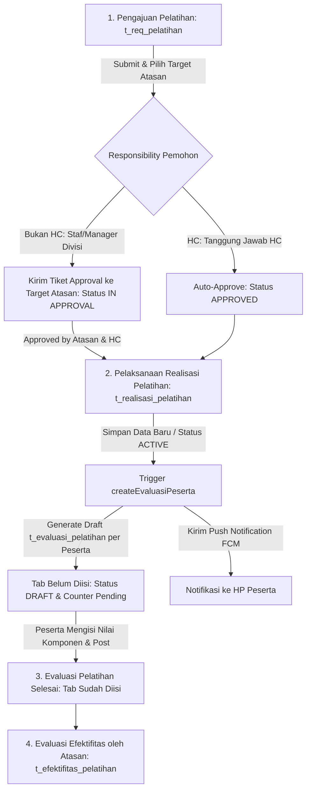

# 🎓 JOBLIST & ANALISA MODUL: PELATIHAN KARYAWAN (HRIS TEMPRINA)
Diperbarui: 2026-08-31

---

## 📌 6. Ringkasan Eksekutif Modul Pelatihan
Modul **Pelatihan Karyawan** di HRIS Temprina mengelola siklus pelatihan secara terintegrasi:
1. **Pengajuan Pelatihan (`t_request_pelatihan` / `t_req_pelatihan`)**: Pengajuan kebutuhan pelatihan oleh divisi atau HC, dilengkapi alur approval berjenjang ke atasan pemohon.
2. **Realisasi Pelatihan (`t_realisasi_pelatihan`)**: Pencatatan pelaksanaan aktual pelatihan, trainer, sarana, dan daftar peserta karyawan (`t_realisasi_pelatihan_d_kary`) dengan status `ACTIVE` / `INACTIVE`.
3. **Evaluasi Pelatihan (`t_evaluasi_pelatihan`)**: Penilaian pelatihan oleh peserta yang otomatis digenerate draft-nya saat realisasi berstatus `ACTIVE` beserta push notifikasi ke HP/device peserta.
4. **Efektifitas Pelatihan (`t_efektifitas_pelatihan`)**: Evaluasi pasca pelatihan oleh atasan peserta untuk mengukur dampak pelatihan terhadap kinerja.

---

## 🔄 7. Alur Bisnis Pelatihan & Evaluasi Peserta

---

## 🗄️ 8. Pemetaan File & Model Terkait Modul Pelatihan

| No | Layer / Entitas | File Model (Migration/Basic/Custom) | File Blade & Javascript | Deskripsi Fungsi |
|---|---|---|---|---|
| 1 | **Master Program Pelatihan** | `Models/m_prog_pelatihan/*` `Models/m_prog_pelatihan_d_divisi/*` `Models/m_prog_pelatihan_d_level/*` | `Blades/m_prog_pelatihan.blade.php` `Javascript/m_prog_pelatihan.js` | Master tema & kurikulum pelatihan |
| 2 | **Master Trainer** | `Models/m_trainer/*` | `Blades/m_trainer.blade.php` `Javascript/m_trainer.js` | Master pengajar/instruktur |
| 3 | **Pengajuan Pelatihan** | `Models/t_request_pelatihan/*` `Models/t_request_pelatihan_d_kary/*` | `Blades/t_req_pelatihan.blade.php` `Javascript/t_req_pelatihan.js` | Transaksi pengajuan kebutuhan pelatihan |
| 4 | **Realisasi Pelatihan** | `Models/t_realisasi_pelatihan/*` `Models/t_realisasi_pelatihan_d_kary/*` | `Blades/t_realisasi_pelatihan.blade.php` `Javascript/t_realisasi_pelatihan.js` | Realisasi jadwal, trainer, & peserta aktif |
| 5 | **Evaluasi Pelatihan** | `Models/t_evaluasi_pelatihan/*` `Models/t_evaluasi_pelatihan_detail/*` | `Blades/t_evaluasi_pelatihan.blade.php` `Javascript/t_evaluasi_pelatihan.js` | Penilaian pelatihan oleh masing-masing peserta |
| 6 | **Efektifitas Pelatihan** | `Models/t_efektifitas_pelatihan/*` `Models/t_efektifitas_pelatihan_detail/*` | `Blades/t_efektifitas_pelatihan.blade.php` `Javascript/t_efektifitas_pelatihan.js` | Evaluasi dampak pelatihan oleh atasan |

---

## 🔍 9. Analisa Temuan Masalah & Bug Feedback Klien

### 1. Bug Auto-Approve HC Keliru pada Pengajuan Pelatihan (`t_request_pelatihan` / `t_req_pelatihan`)
- **Penyebab**: 
  - Di `Models/t_request_pelatihan/Custom.php` baris 180, penentuan `$is_hc` mencakup `user_type == 'admin'`, atau username `developer` / `danvers`, serta membaca atribut global tanpa memvalidasi **responsibility yang sedang aktif**.
  - Jika seorang staf atau akun testing mengajukan pelatihan dan memilih target approval manager divisinya, sistem malah mengeksekusi blok auto-approve HC (`APPROVED AUTO BY HC`), memotong flow approval normal.
  - Di `Blades/t_req_pelatihan.blade.php` dan `Javascript/t_req_pelatihan.js` juga terdapat hardcode `isUserHC` serupa.
- **Solusi**:
  - Validasi responsibility aktif pemohon melalui `getCore('Respo')->checkRespoActive()` dan periksa apakah responsibility yang aktif benar-benar memiliki tanggung jawab HC.
  - Jika responsibility pemohon bukan HC, wajib menjalankan alur approval berjenjang normal: membuat tiket approval ke target atasan (`target_id` / manager divisi), mengubah status menjadi `IN APPROVAL`, dan mengirim push notifikasi FCM ke target atasan.

### 2. Trigger Pembuatan Draft Evaluasi & Notifikasi saat Realisasi Pelatihan Dibuat / Status `ACTIVE`
- **Penyebab**:
  - Modul `t_realisasi_pelatihan` tidak menggunakan siklus DRAFT/POST, melainkan `ACTIVE` / `INACTIVE`.
  - Saat ini, method `createEvaluasiPeserta($data)` hanya dipanggil pada `custom_posted`, `custom_progress`, dan `custom_approveHC`. Saat data baru disimpan atau diupdate menjadi `ACTIVE` via `createAfter` / `updateAfter`, pembuatan draft evaluasi **belum terpanggil**.
- **Solusi**:
  - Tambahkan hook di `createAfter` dan `updateAfter` pada `Models/t_realisasi_pelatihan/Custom.php` untuk memanggil `createEvaluasiPeserta($model)` apabila status data bernilai `ACTIVE`.
  - Pastikan setiap peserta di `t_realisasi_pelatihan_d_kary` dibuatkan header `t_evaluasi_pelatihan` dengan status `DRAFT` dan menerima push notification FCM.

### 3. Fallback Pemuatan Komponen Pertanyaan Evaluasi di Frontend (`t_evaluasi_pelatihan.js`)
- **Penyebab**:
  - Ketika peserta membuka draft evaluasi via tombol pensil "Isi Evaluasi" (`t_evaluasi_pelatihan/{id}?action=Edit`), route berstatus `isRead = true`.
  - Pada `isRead = true`, kode hanya membaca detail dari database. Karena draft auto-generated baru berisi header, `t_evaluasi_pelatihan_detail` masih bernilai kosong (`[]`), dan `loadTipePenilaian()` tidak terpanggil sehingga pertanyaan penilaian tidak tampil.
- **Solusi**:
  - Tambahkan fallback di `loadData()` pada `Javascript/t_evaluasi_pelatihan.js`: jika `initialValues.t_evaluasi_pelatihan_detail` kosong, panggil `loadTipePenilaian()` dari `m_general` agar daftar pertanyaan evaluasi langsung ter-render.

---

## 📋 10. Actionable Roadmap & Task Checklist Pelatihan

### 🚀 TAHAP 6: Perbaikan Otorisasi & Alur Approval Pengajuan Pelatihan
- [x] **[Models/t_request_pelatihan/Custom.php](file:///c:/Users/Rey%20Cannavaro/hris-temprina-dev/Models/t_request_pelatihan/Custom.php)**:
  - Validasi responsibility aktif pemohon (`checkRespoActive()` & respo role HC).
  - Hapus hardcode auto-approve untuk akun admin/developer non-HC.
  - Pastikan pengajuan dari akun non-HC membuat tiket approval ke `target_id` atasan dan mengupdate status ke `IN APPROVAL`.
- [x] **[Blades/t_req_pelatihan.blade.php](file:///c:/Users/Rey%20Cannavaro/hris-temprina-dev/Blades/t_req_pelatihan.blade.php)** & **[Javascript/t_req_pelatihan.js](file:///c:/Users/Rey%20Cannavaro/hris-temprina-dev/Javascript/t_req_pelatihan.js)**:
  - Bersihkan hardcode `isUserHC` agar FieldSelect target approver tetap tampil bagi user non-HC.

### 📦 TAHAP 7: Trigger Evaluasi & Notifikasi saat Realisasi Pelatihan Berstatus `ACTIVE`
- [x] **[Models/t_realisasi_pelatihan/Custom.php](file:///c:/Users/Rey%20Cannavaro/hris-temprina-dev/Models/t_realisasi_pelatihan/Custom.php)**:
  - Tambahkan hook `createAfter()` dan `updateAfter()` yang memicu `createEvaluasiPeserta()` saat status adalah `ACTIVE`.
  - Pastikan `createEvaluasiPeserta()` membuat draft `t_evaluasi_pelatihan` (status `DRAFT`) untuk seluruh peserta di `t_realisasi_pelatihan_d_kary`.
  - Pastikan pengiriman push notifikasi FCM (`sendEvaluasiNotification`) terkirim ke masing-masing akun peserta.

### 📝 TAHAP 8: Sinkronisasi Form & Landing Page Evaluasi Pelatihan
- [x] **[Javascript/t_evaluasi_pelatihan.js](file:///c:/Users/Rey%20Cannavaro/hris-temprina-dev/Javascript/t_evaluasi_pelatihan.js)**:
  - Tambahkan fallback pemanggilan `loadTipePenilaian()` di `loadData()` jika detail draft masih kosong.
  - Pastikan counter `pendingCount` pada tab "Belum Diisi" merefleksikan jumlah evaluasi berstatus `DRAFT` peserta.

### ✅ TAHAP 9: Pengujian & Validasi End-to-End Pelatihan
- [ ] Uji pengajuan pelatihan oleh akun staf ke Manager Divisi: verifikasi status menjadi `IN APPROVAL` dan tiket approval terbentuk.
- [ ] Uji pengajuan pelatihan oleh akun dengan responsibility HC: verifikasi auto-approve hanya terjadi untuk HC.
- [ ] Uji pembuatan Realisasi Pelatihan berstatus `ACTIVE`: verifikasi draft evaluasi terbentuk untuk semua peserta di `t_realisasi_pelatihan_d_kary` dan notifikasi terkirim.
- [ ] Uji pengisian evaluasi oleh peserta pelatihan dari tab "Belum Diisi" hingga tersimpan dan berpindah ke tab "Sudah Diisi".