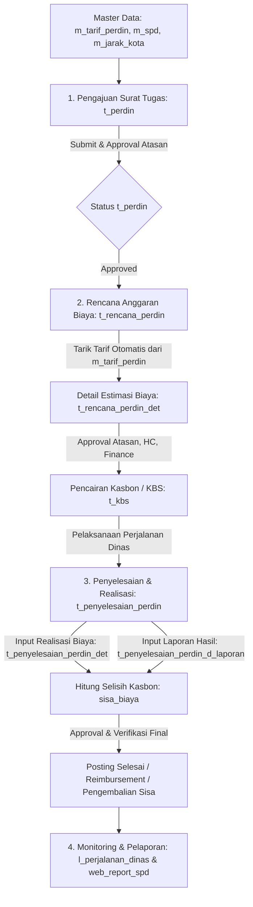

# JOBLIST & ANALISA MODUL: PERJALANAN DINAS (HRIS TEMPRINA)
Diperbarui: 2026-08-26

---

## 📌 1. Ringkasan Eksekutif Modul Perjalanan Dinas
Modul **Perjalanan Dinas** di HRIS Temprina dirancang untuk mengelola seluruh siklus perjalanan dinas karyawan secara *end-to-end*, mulai dari permohonan surat tugas, penyusunan rencana anggaran biaya (estimasi kasbon), pelaksanaan persetujuan bertingkat (*multi-tier approval*), hingga pelaporan realisasi pengeluaran dan penyelesaian selisih kasbon (*reimbursement* / pengembalian).

---

## 🔄 2. Alur Bisnis (Business Flow) End-to-End

### Tahapan Alur Kerja:

### A. Tahap 1: Pengajuan Surat Tugas (`t_perdin`)
1. Karyawan / Admin mengajukan permohonan dinas baru melalui form `t_perdin`.
2. Input data utama: Karyawan (`m_kary_id`), Posisi/Jabatan (`m_posisi_id`), Atasan Penyetuju (`m_atasan_id`), Tanggal Berangkat (`date_from`) s/d Tanggal Kembali (`date_to`), Tujuan (Provinsi, Kota, Kecamatan, Alamat), dan Tugas/Keperluan dinas.
3. Sistem secara otomatis men-generate nomor surat tugas (format: `PERDIN/...`).
4. Status awal adalah `DRAFT` dan masuk ke alur persetujuan atasan (`SUBMITTED` -> `APPROVED`).

### B. Tahap 2: Rencana Anggaran Biaya & Kasbon (`t_rencana_perdin`)
1. Setelah `t_perdin` disetujui, karyawan membuat Rencana Biaya Perdin (`t_rencana_perdin`).
2. Karyawan memilih nomor referensi `t_perdin_id`.
3. Komponen estimasi biaya di `t_rencana_perdin_det` ditarik secara otomatis dari master tarif (`m_tarif_perdin` berdasarkan level jabatan karyawan) seperti: uang saku/harian, penginapan/hotel, transportasi, dan makan.
4. Total biaya estimasi diajukan ke HC & Finance untuk persetujuan.
5. Setelah disetujui (`APPROVED`), data kasbon diteruskan ke kasir/finance untuk pencairan uang muka/kasbon (`t_kbs`).

### C. Tahap 3: Pelaksanaan & Penyelesaian Perjalanan Dinas (`t_penyelesaian_perdin`)
1. Setelah dinas selesai, karyawan wajib membuat Laporan Pertanggungjawaban (LPJ) melalui form `t_penyelesaian_perdin`.
2. Sistem otomatis menarik data kasbon yang sudah cair (`nominal_kbs`, `no_kbs`).
3. Karyawan menginputkan:
   - **Realisasi Biaya Riil** (`t_penyelesaian_perdin_det`): Nominal aktual yang dikeluarkan disertai bukti nota/struk (tiket, bensin, hotel, dll.).
   - **Laporan Kegiatan** (`t_penyelesaian_perdin_d_laporan`): Ringkasan hasil dinas dan foto/lampiran dokumentasi.
4. Sistem menghitung selisih (`sisa_biaya = nominal_kbs - total_biaya`):
   - **Lebih Kasbon (`sisa_biaya > 0`)**: Karyawan mengembalikan sisa uang kasbon ke kasir.
   - **Kurang Kasbon / Reimbursement (`sisa_biaya < 0`)**: Perusahaan mengganti kekurangan biaya dinas kepada karyawan.
5. Approval LPJ: Diverifikasi oleh Atasan, HC, dan Finance hingga status `POSTED`.

### D. Tahap 4: Pelaporan & Monitoring
- `l_perjalanan_dinas`: Rekapitulasi transaksi dinas, perbandingan rencana anggaran vs realisasi riil.
- `web_report_spd`: Template cetak dokumen fisik surat perintah perjalanan dinas resmi.

---

## 🗄️ 3. Pemetaan File & Model Terkait

| No | Layer / Entitas | File Model (Migration/Basic/Custom) | File Blade & Javascript | Deskripsi Fungsi |
|---|---|---|---|---|
| 1 | **Master Tarif Perdin** | `Models/m_tarif_perdin/*` `Models/m_tarif_perdin_det/*` | `Blades/m_tarif_perdin.blade.php` `Javascript/m_tarif_perdin.js` | Master plafon biaya perdin per level posisi |
| 2 | **Master SPD Aturan** | `Models/m_spd/*` `Models/m_spd_det_biaya/*` `Models/m_spd_det_transport/*` | `Blades/m_spd.blade.php` `Javascript/m_spd.js` | Master template & parameter SPD per cabang/divisi |
| 3 | **Surat Tugas Perdin** | `Models/t_perdin/*` | `Blades/t_perdin.blade.php` `Javascript/t_perdin.js` | Transaksi pengajuan surat tugas dinas |
| 4 | **Rencana Biaya (RPD)** | `Models/t_rencana_perdin/*` `Models/t_rencana_perdin_det/*` | `Blades/t_rencana_perdin.blade.php` `Javascript/t_rencana_perdin.js` | Estimasi biaya & pengajuan kasbon perdin |
| 5 | **Penyelesaian (PPD)** | `Models/t_penyelesaian_perdin/*` `Models/t_penyelesaian_perdin_det/*` `Models/t_penyelesaian_perdin_d_laporan/*` | `Blades/t_penyelesaian_perdin.blade.php` `Javascript/t_penyelesaian_perdin.js` | LPJ realisasi pengeluaran & selisih kasbon |
| 6 | **Penyelesaian Karyawan** | - | `Blades/t_penyelesaian_perdin_karyawan.blade.php` `Javascript/t_penyelesaian_perdin_karyawan.js` | View khusus sisi karyawan untuk input LPJ mandiri |
| 7 | **Laporan & Cetak** | - | `Blades/l_perjalanan_dinas.blade.php` `Blades/web_report_spd.blade.php` | Rekapitulasi laporan monitoring & cetak PDF/Web |

---

## 🔍 4. Analisa Temuan Masalah & Potensi Bug pada Modul Perdin

Berdasarkan penelusuran menyeluruh pada seluruh kode modul:

1. **Bug Pemilihan Perdin Kosong di Penyelesaian (`t_penyelesaian_perdin`)**:
   - **Penyebab**: Filter `scopeusedPerdin` di `t_perdin/Custom.php` melakukan filter `where('m_kary_id', $m_kary_id)`. Jika user bertipe `admin`, `$m_kary_id` bernilai `null` sehingga query mengembalikan **0 baris**.
   - Selain itu, filter status `whereHas('t_rencana_perdin', fn($q) => $q->where('status', 'APPROVED'))` bersifat *case-sensitive* di PostgreSQL sehingga rentan *mismatch*.
   - Parameter `searchfield` di `Blades/t_penyelesaian_perdin.blade.php` memiliki kolom `date_to` tanpa prefix `this.`.

2. **Bug Data Detail (Biaya & Laporan) Tidak Muncul / Hilang saat Read & Update**:
   - **Penyebab**: Di `Models/t_penyelesaian_perdin/Custom.php` belum ada method `transformRowData()` dan `updateBefore()`.
   - Di `Javascript/t_penyelesaian_perdin.js` baris 292–297, kode langsung melakukan `initialValues.t_penyelesaian_perdin_det.map(...)` tanpa fallback array kosong `|| []`, memicu *crash TypeError* (`Cannot read properties of undefined`) yang mematikan form.
   - Masih ada sisa validasi inventory `item.qty === null` (baris 430) pada form perdin.

3. **Bug Auto-Generate Tarif Rencana Perdin (`t_rencana_perdin`)**:
   - **Penyebab**: Method `custom_generateTarif` di `Models/t_rencana_perdin/Custom.php` mencari kolom `kota_id, provinsi_id, posisi_id` pada `m_tarif_perdin`, padahal kolom skema database adalah `m_level_posisi_id`.

4. **Konsep & Standarisasi Alur Approval (`Approval Workflow`)**:
   - Ticket approval pada `t_rencana_perdin` (`APPROVAL RINCIAN PERDIN`) dan `t_penyelesaian_perdin` (`APPROVAL PENYELESAIAN PERDIN`) perlu standarisasi penanganan target approval ke atasan pemohon.
   - Proteksi notifikasi Firebase agar tidak melempar error saat token FCM target kosong.
   - Penyeragaman status approval menjadi `IN APPROVAL`, `APPROVED`, `REJECTED`, `REVISED`, dan `POSTED`.

---

## 📋 5. Actionable Roadmap & Task Checklist

### 🚀 TAHAP 1: Perbaikan Pemilihan Perdin di Form Penyelesaian (Fokus Feedback Klien)
- [x] **[Models/t_perdin/Custom.php](file:///c:/Users/Rey%20Cannavaro/hris-temprina-dev/Models/t_perdin/Custom.php)**:
  - Perbaiki `scopeusedPerdin`: Izinkan Admin / HC melihat semua perdin berstatus rencana `APPROVED`.
  - Normalisasi filter status case-insensitive: `upper(status) = 'APPROVED'`.
  - Gunakan `$user->m_kary_id` dengan fallback query `m_kary`.
- [x] **[Blades/t_penyelesaian_perdin.blade.php](file:///c:/Users/Rey%20Cannavaro/hris-temprina-dev/Blades/t_penyelesaian_perdin.blade.php)** & **[Blades/t_penyelesaian_perdin_karyawan.blade.php](file:///c:/Users/Rey%20Cannavaro/hris-temprina-dev/Blades/t_penyelesaian_perdin_karyawan.blade.php)**:
  - Perbaiki `searchfield` pada `FieldPopup` (tambahkan prefix `this.date_to`).
  - Pastikan event `@update:valueFull` memetakan seluruh data perdin ke form values secara presisi.

### 📦 TAHAP 2: Perbaikan Data Detail Biaya & Laporan Kegiatan
- [x] **[Models/t_penyelesaian_perdin/Custom.php](file:///c:/Users/Rey%20Cannavaro/hris-temprina-dev/Models/t_penyelesaian_perdin/Custom.php)**:
  - Tambahkan method `transformRowData()` untuk mengambil `t_penyelesaian_perdin_det` dan `t_penyelesaian_perdin_d_laporan`.
  - Tambahkan method `updateBefore()` untuk menginisialisasi `$this->details = ["t_penyelesaian_perdin_det", "t_penyelesaian_perdin_d_laporan"]`.
- [x] **[Javascript/t_penyelesaian_perdin.js](file:///c:/Users/Rey%20Cannavaro/hris-temprina-dev/Javascript/t_penyelesaian_perdin.js)**:
  - Beri proteksi fallback array kosong `(initialValues.t_penyelesaian_perdin_det || []).map(...)` saat read mode.
  - Hapus duplikasi looping `forEach` detail yang redundan.
  - Bersihkan sisa validasi inventory `qty/qty_2` pada `onSave()`.

### 💵 TAHAP 3: Perbaikan Penarikan Tarif Rencana Perdin
- [ ] **[Models/t_rencana_perdin/Custom.php](file:///c:/Users/Rey%20Cannavaro/hris-temprina-dev/Models/t_rencana_perdin/Custom.php)**:
  - Perbaiki `custom_generateTarif` & `public_generateTarif` agar membaca `m_level_posisi_id` dari posisi karyawan pemohon.
- [ ] **[Javascript/t_rencana_perdin.js](file:///c:/Users/Rey%20Cannavaro/hris-temprina-dev/Javascript/t_rencana_perdin.js)**:
  - Sesuaikan payload request generate tarif agar mengirimkan `m_posisi_id` / `m_level_posisi_id`.

### 🛡️ TAHAP 4: Standarisasi Konsep Approval & Notifikasi
- [ ] **[Models/t_penyelesaian_perdin/Custom.php](file:///c:/Users/Rey%20Cannavaro/hris-temprina-dev/Models/t_penyelesaian_perdin/Custom.php)**:
  - Sinkronisasi `createAppTicket`, `custom_progress`, dan `custom_approveHC`.
  - Proteksi exception saat generate KBR jika koneksi ERP tidak aktif.
- [ ] **[Models/t_rencana_perdin/Custom.php](file:///c:/Users/Rey%20Cannavaro/hris-temprina-dev/Models/t_rencana_perdin/Custom.php)**:
  - Sinkronisasi ticket approval dan notifikasi FCM.

### ✅ TAHAP 5: Pengujian & Validasi End-to-End
- [ ] Verifikasi pemilihan nomor perdin di form Penyelesaian Perjalanan Dinas.
- [ ] Verifikasi simpan, read, dan edit detail biaya serta laporan kegiatan.
- [ ] Verifikasi kalkulasi selisih kasbon (`nominal_kbs - total_biaya`).
- [ ] Verifikasi alur approval dari status `DRAFT` -> `IN APPROVAL` -> `APPROVED` -> `POSTED`.