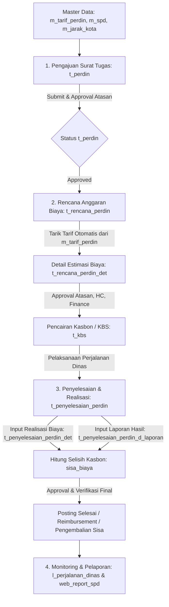

# JOBLIST & ANALISA MODUL: PERJALANAN DINAS (HRIS TEMPRINA)
Diperbarui: 2026-08-26

---

## 📌 1. Ringkasan Eksekutif Modul Perjalanan Dinas
Modul **Perjalanan Dinas** di HRIS Temprina dirancang untuk mengelola seluruh siklus perjalanan dinas karyawan secara *end-to-end*, mulai dari permohonan surat tugas, penyusunan rencana anggaran biaya (estimasi kasbon), pelaksanaan persetujuan bertingkat (*multi-tier approval*), hingga pelaporan realisasi pengeluaran dan penyelesaian selisih kasbon (*reimbursement* / pengembalian).

---

## 🔄 2. Alur Bisnis (Business Flow) End-to-End

### Tahapan Alur Kerja:

### A. Tahap 1: Pengajuan Surat Tugas (`t_perdin`)
1. Karyawan / Admin mengajukan permohonan dinas baru melalui form `t_perdin`.
2. Input data utama: Karyawan (`m_kary_id`), Posisi/Jabatan (`m_posisi_id`), Atasan Penyetuju (`m_atasan_id`), Tanggal Berangkat (`date_from`) s/d Tanggal Kembali (`date_to`), Tujuan (Provinsi, Kota, Kecamatan, Alamat), dan Tugas/Keperluan dinas.
3. Sistem secara otomatis men-generate nomor surat tugas (format: `PERDIN/...`).
4. Status awal adalah `DRAFT` dan masuk ke alur persetujuan atasan (`SUBMITTED` -> `APPROVED`).

### B. Tahap 2: Rencana Anggaran Biaya & Kasbon (`t_rencana_perdin`)
1. Setelah `t_perdin` disetujui, karyawan membuat Rencana Biaya Perdin (`t_rencana_perdin`).
2. Karyawan memilih nomor referensi `t_perdin_id`.
3. Komponen estimasi biaya di `t_rencana_perdin_det` ditarik secara otomatis dari master tarif (`m_tarif_perdin` berdasarkan level jabatan karyawan) seperti: uang saku/harian, penginapan/hotel, transportasi, dan makan.
4. Total biaya estimasi diajukan ke HC & Finance untuk persetujuan.
5. Setelah disetujui (`APPROVED`), data kasbon diteruskan ke kasir/finance untuk pencairan uang muka/kasbon (`t_kbs`).

### C. Tahap 3: Pelaksanaan & Penyelesaian Perjalanan Dinas (`t_penyelesaian_perdin`)
1. Setelah dinas selesai, karyawan wajib membuat Laporan Pertanggungjawaban (LPJ) melalui form `t_penyelesaian_perdin`.
2. Sistem otomatis menarik data kasbon yang sudah cair (`nominal_kbs`, `no_kbs`).
3. Karyawan menginputkan:
   - **Realisasi Biaya Riil** (`t_penyelesaian_perdin_det`): Nominal aktual yang dikeluarkan disertai bukti nota/struk (tiket, bensin, hotel, dll.).
   - **Laporan Kegiatan** (`t_penyelesaian_perdin_d_laporan`): Ringkasan hasil dinas dan foto/lampiran dokumentasi.
4. Sistem menghitung selisih (`sisa_biaya = nominal_kbs - total_biaya`):
   - **Lebih Kasbon (`sisa_biaya > 0`)**: Karyawan mengembalikan sisa uang kasbon ke kasir.
   - **Kurang Kasbon / Reimbursement (`sisa_biaya < 0`)**: Perusahaan mengganti kekurangan biaya dinas kepada karyawan.
5. Approval LPJ: Diverifikasi oleh Atasan, HC, dan Finance hingga status `POSTED`.

### D. Tahap 4: Pelaporan & Monitoring
- `l_perjalanan_dinas`: Rekapitulasi transaksi dinas, perbandingan rencana anggaran vs realisasi riil.
- `web_report_spd`: Template cetak dokumen fisik surat perintah perjalanan dinas resmi.

---

## 🗄️ 3. Pemetaan File & Model Terkait

| No | Layer / Entitas | File Model (Migration/Basic/Custom) | File Blade & Javascript | Deskripsi Fungsi |
|---|---|---|---|---|
| 1 | **Master Tarif Perdin** | `Models/m_tarif_perdin/*` `Models/m_tarif_perdin_det/*` | `Blades/m_tarif_perdin.blade.php` `Javascript/m_tarif_perdin.js` | Master plafon biaya perdin per level posisi |
| 2 | **Master SPD Aturan** | `Models/m_spd/*` `Models/m_spd_det_biaya/*` `Models/m_spd_det_transport/*` | `Blades/m_spd.blade.php` `Javascript/m_spd.js` | Master template & parameter SPD per cabang/divisi |
| 3 | **Surat Tugas Perdin** | `Models/t_perdin/*` | `Blades/t_perdin.blade.php` `Javascript/t_perdin.js` | Transaksi pengajuan surat tugas dinas |
| 4 | **Rencana Biaya (RPD)** | `Models/t_rencana_perdin/*` `Models/t_rencana_perdin_det/*` | `Blades/t_rencana_perdin.blade.php` `Javascript/t_rencana_perdin.js` | Estimasi biaya & pengajuan kasbon perdin |
| 5 | **Penyelesaian (PPD)** | `Models/t_penyelesaian_perdin/*` `Models/t_penyelesaian_perdin_det/*` `Models/t_penyelesaian_perdin_d_laporan/*` | `Blades/t_penyelesaian_perdin.blade.php` `Javascript/t_penyelesaian_perdin.js` | LPJ realisasi pengeluaran & selisih kasbon |
| 6 | **Penyelesaian Karyawan** | - | `Blades/t_penyelesaian_perdin_karyawan.blade.php` `Javascript/t_penyelesaian_perdin_karyawan.js` | View khusus sisi karyawan untuk input LPJ mandiri |
| 7 | **Laporan & Cetak** | - | `Blades/l_perjalanan_dinas.blade.php` `Blades/web_report_spd.blade.php` | Rekapitulasi laporan monitoring & cetak PDF/Web |

---

## 🔍 4. Analisa Temuan Masalah & Potensi Bug pada Modul Perdin

Berdasarkan penelusuran kode yang ada di repositori:

1. **Bug Query Tarif pada `t_rencana_perdin/Custom.php`**:
   - Di `custom_generateTarif` / `public_generateTarif`, query `m_tarif_perdin` memfilter kolom `kota_id`, `provinsi_id`, dan `posisi_id`.
   - **Fakta Skema Database**: Pada tabel `m_tarif_perdin`, kolom yang ada adalah `m_level_posisi_id` (bukan `posisi_id` / `kota_id`). Hal ini menyebabkan *auto-generate* tarif estimasi biaya sering kosong / gagal.
2. **Duplikasi Join Atasan pada `t_perdin/Custom.php`**:
   - Di `t_perdin/Basic.php`, terdapat default join `m_kary.id=t_perdin.m_atasan_id`. Di `Custom.php`, dilakukan override join manual `m_kary.id=t_perdin.m_kary_id`. Perlu dipastikan relasi atasan menggunakan alias terpisah (misal `atasan.nama_lengkap`) agar tidak bertabrakan dengan data karyawan pemohon.
3. **Keterikatan Status Transaksi & Kasbon**:
   - Filter `scopelistPerdin` dan `scopeusedPerdin` pada `t_perdin` bergantung pada status `APPROVED` di `t_rencana_perdin`. Jika status tersimpan dengan case berbeda (misal `Approved` vs `APPROVED`), relasi dropdown di `t_penyelesaian_perdin` tidak memunculkan nomor perdin terkait.
4. **Penyelesaian Kasbon (`sisa_biaya`)**:
   - Sinkronisasi nominal kasbon (`nominal_kbs`) dengan total realisasi (`total_biaya`) pada `t_penyelesaian_perdin` membutuhkan validasi presisi saat mode edit atau revisi agar selisih biaya tetap akurat.

---

## 📋 5. Checklist Pekerjaan (Joblist)

- [ ] Konfirmasi feedback spesifik klien untuk modul Perjalanan Dinas
- [ ] Review & sinkronisasi relasi `m_tarif_perdin` dengan level posisi karyawan pada `t_rencana_perdin`
- [ ] Validasi flow approval notifikasi pada `t_perdin` dan `t_rencana_perdin`
- [ ] Verifikasi penarikan kasbon dan perhitungan sisa biaya pada `t_penyelesaian_perdin`
- [ ] Pengujian menyeluruh alur pengajuan -> rencana -> LPJ penyelesaian
