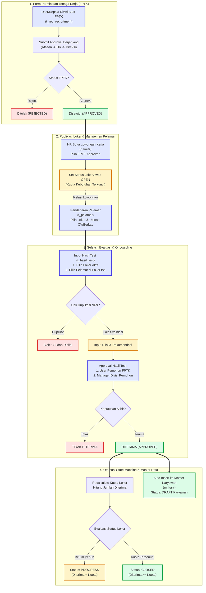

# 📖 KONSEP, ARSITEKTUR, DAN ALUR MODUL REKRUTMEN (HRIS TEMPRINA)
**Pembaruan Terakhir**: 11-09-2026  
**Dokumen**: Blueprint Konseptual & Arsitektur Modul Rekrutmen Terintegrasi  
**Target Platform**: HRIS Temprina (Core Generator Architecture)

---

## 📌 1. Latar Belakang & Filosofi Desain

Modul Rekrutmen pada HRIS Temprina dirancang untuk menghubungkan kebutuhan formasi tenaga kerja dari unit kerja (*hulu*) hingga proses onboarding karyawan baru ke dalam sistem master karyawan (*hilir*). 

Sebelum adanya integrasi menyeluruh, sering terjadi tantangan operasional:
1. **Perekrutan Tanpa Dasar FPTK**: Pembukaan lowongan kerja tidak memiliki keterikatan langsung dengan pengajuan formasi resmi yang telah disetujui manajemen.
2. **Monitoring Kuota Manual**: HR kesulitan memantau apakah kebutuhan karyawan pada suatu divisi sudah terpenuhi, masih kurang, atau berlebih (*over-hiring*).
3. **Data Disconnected & Redundant Data Entry**: Ketika pelamar dinyatakan lolos dan diterima, HR harus menginput ulang data identitas pelamar secara manual ke tabel Master Karyawan (`m_kary`).
4. **Human Error pada Penilaian**: Adanya potensi penilaian ganda (*duplicate scoring*) atau salah memilih pelamar lintas lowongan pekerjaan.

**Solusi Arsitektur**: Mengintegrasikan seluruh siklus ke dalam satu **State Machine & Pipeline Rekrutmen Terpadu** yang aman, otomatis, dan terkontrol melalui otorisasi approval berjenjang.

---

## 🔄 2. Arsitektur & Urutan Menu Rekrutmen (`m_menu`)

Sesuai dengan standarisasi alur kerja operasional, hierarki modul rekrutmen pada menu aplikasi diurutkan secara sekuensial:

```
┌─────────────────────────────────────────────────────────────────────────────┐
│                       STRUKTUR MENU REKRUTMEN                              │
│                                                                             │
│  1. 📄 Pengajuan Recruitment (t_req_recruitment)                           │
│        └─ Permintaan Karyawan Baru / Penggantian (FPTK) + Approval          │
│                                                                             │
│  2. 📢 Lowongan Pekerjaan (t_lowongan_kerja / t_loker)                     │
│        └─ Pembukaan Loker berbasis FPTK Approved + Tracking Kuota & Status  │
│                                                                             │
│  3. 👤 Pelamar (t_pelamar)                                                  │
│        └─ Database Kandidat, Relasi Loker, & Upload Dokumen/CV              │
│                                                                             │
│  4. 📝 Hasil Test Lamaran Kerja (t_hasil_test)                             │
│        └─ Input Nilai Berjenjang, Anti-Duplikasi, Approval & Auto-Onboard   │
└─────────────────────────────────────────────────────────────────────────────┘
```

---

## 🌊 3. Diagram Alur Bisnis End-to-End (Recruitment Pipeline)



---

## 🧱 4. Rincian Konseptual per Modul & Aturan Bisnis

### 1️⃣ Modul Pengajuan Rekrutmen / FPTK (`t_req_recruitment`)
* **Tujuan**: Menjadi pintu masuk formal bagi kepala divisi/unit kerja untuk mengajukan kebutuhan personil baru atau penggantian karyawan (*replacement*).
* **Entitas Data**:
  - **Identitas**: Nomor pengajuan, tanggal, pemohon (`m_kary_id` auto dari user login).
  - **Organisasi**: Perusahaan (`m_comp_id`), Unit/Subcomp (`m_subcomp_id`), Cabang (`m_branch_id`), Divisi (`m_divisi_id`), Departemen (`m_dept_id`), Posisi (`m_posisi_id`).
  - **Spesifikasi Kebutuhan**: Jumlah personil yang dibutuhkan (`jumlah_kebutuhan`), status karyawan yang diinginkan (Tetap/Kontrak/Magang), jenis permintaan (Penambahan/Penggantian), tanggal dibutuhkan, prioritas (Normal/Urgent), dan alasan justifikasi.
* **Aturan Bisnis**:
  - Pengajuan berstatus `DRAFT` saat dibuat.
  - Harus melalui alur approval berjenjang (`IN APPROVAL` $\rightarrow$ `APPROVED` / `REJECTED`).
  - **Kondisi Kunci**: Hanya pengajuan yang berstatus **`APPROVED`** yang berhak ditarik/dipilih pada modul Lowongan Kerja.

---

### 2️⃣ Modul Lowongan Kerja (`t_lowongan_kerja` / `t_loker`)
* **Tujuan**: Membuka dan mempublikasikan lowongan kerja internal/eksternal yang sah berdasarkan FPTK.
* **Aksesibilitas Admin**:
  - Akun Administrator / HR Central memiliki hak akses global (**Bypass `scoperespo`**) untuk memantau seluruh lowongan dari seluruh unit kerja tanpa terisolasi oleh cabang tertentu.
* **Keterikatan FPTK**:
  - Wajib memilih `t_req_recruitment_id` (hanya menampilkan data FPTK yang `APPROVED` dan kuotanya belum selesai).
  - Data organisasi (Perusahaan, Cabang, Divisi, Posisi) dan jumlah kebutuhan otomatis tersinkronisasi dari FPTK terpilih.
* **State Machine Status Lowongan Kerja**:
  
  | Status | Definisi & Kondisi Pemicu | Efek pada Sistem |
  |---|---|---|
  | **`OPEN`** | Lowongan baru dibuka atau belum ada satupun kandidat yang diterima (`diterima == 0`). | Muncul di pilihan pendaftaran pelamar & form input hasil tes. |
  | **`PROGRESS`** | Sudah ada pelamar yang diterima, tetapi jumlahnya belum memenuhi kuota kebutuhan (`0 < diterima < jumlah_kebutuhan`). | Tetap muncul di pilihan hasil tes untuk memenuhi sisa kuota yang kurang. |
  | **`CLOSED`** | Jumlah pelamar yang diterima telah memenuhi atau melebihi kuota (`diterima >= jumlah_kebutuhan`), atau ditutup manual oleh HR. | **Otomatis disembunyikan** dari dropdown/popup pilihan pada form Hasil Test & Pendaftaran baru. |

---

### 3️⃣ Modul Pelamar (`t_pelamar`)
* **Tujuan**: Menyimpan repositori profil lengkap calon tenaga kerja dan portofolio pelamar.
* **Relasi Loker**:
  - Setiap pelamar wajib dikaitkan dengan lowongan kerja yang dilamar melalui foreign key `t_loker_id`.
* **Manajemen Berkas & Portofolio**:
  - Fitur upload berkas Curriculum Vitae (`file_cv`).
  - Fitur upload berkas pendukung seperti sertifikat, portofolio, SKCK, ijazah (`file_dokumen`).
* **Kelengkapan Profil Standar**:
  - NIK KTP, Nama Lengkap, Nama Panggilan, Tempat & Tanggal Lahir, Jenis Kelamin, Nomor Telepon/WhatsApp, Email, Alamat Domisili, dan Akun Media Sosial/LinkedIn.
  - Detail riwayat pendidikan (`t_pelamar_det_pend`), pengalaman kerja (`t_pelamar_det_peng`), pelatihan (`t_pelamar_det_pel`), dan organisasi (`t_pelamar_det_org`).

---

### 4️⃣ Modul Hasil Test Lamaran Kerja (`t_hasil_test`)
* **Tujuan**: Mencatat hasil penilaian tahapan seleksi (Administrasi, Psikotes, Tes Tulis, Wawancara User, Wawancara Direksi) dan menentukan kelulusan akhir.
* **Mekanisme Form Input Berjenjang (Cascading UI)**:
  1. **Langkah 1**: User memilih **Nama Lowongan Kerja** (`t_loker_id`). Sistem hanya menampilkan loker yang berstatus `OPEN` atau `PROGRESS`. Loker berstatus `CLOSED` tidak ditampilkan.
  2. **Langkah 2**: User memilih **Nama Pelamar** (`t_pelamar_id`). Popup/dropdown pelamar otomatis memfilter hanya kandidat yang terdaftar pada loker yang dipilih pada Langkah 1.
* **Proteksi Duplikasi (Anti-Duplication Guard)**:
  - Sistem memeriksa apakah kandidat tersebut sudah memiliki data hasil tes pada loker dan tahapan yang bersangkutan.
  - Jika data sudah ada, sistem menolak penyimpanan data baru untuk menghindari duplikasi nilai.
* **Alur Approval Berjenjang Hasil Tes**:
  - Tiket approval hasil tes diarahkan secara otomatis dan langsung kepada:
    1. **User Pemohon FPTK**: Penilai teknis/kebutuhan user langsung.
    2. **Manager / Atasan Divisi Pemohon**: Pengambil keputusan formasi divisi.
    3. **HR / HC Management**: Otorisasi administratif penerimaan karyawan.

---

### 5️⃣ Mekanisme Otomasi Auto-Sinkronisasi ke Master Karyawan (`m_kary`)
* **Pemicu (Trigger)**: Terbitnya status **`DITERIMA` / `APPROVED`** pada transaksi Hasil Test kandidat.
* **Alur Eksekusi Otomatis**:
  1. Sistem membaca seluruh data identitas dari `t_pelamar` (`nama_lengkap`, `ktp_no`, `telp`, `email`, `tempat_lahir`, `tgl_lahir`, `jk_id`, alamat, dll.).
  2. Sistem membaca data organisasi penempatan dari `t_loker` / `t_req_recruitment` (`m_comp_id`, `m_subcomp_id`, `m_branch_id`, `m_divisi_id`, `m_dept_id`, `m_posisi_id`, `status_kary_id`).
  3. Sistem membuat record baru di tabel `m_kary` dengan status awal **`DRAFT`**.
  4. Riwayat pendidikan, sertifikasi, dan pengalaman kerja pelamar otomatis disalin ke detail karyawan (`m_kary_det_pend`, `m_kary_det_pel`, `m_kary_det_peng`).
  5. **Keuntungan bagi HR**: HRD tidak perlu menginput ulang profil dari awal. HRD cukup membuka menu Master Karyawan untuk melengkapi data administratif lanjutan (Nomor Induk Karyawan/NPP, No BPJS Kesehatan/TK, Nomor Rekening Gaji, Jadwal Jam Kerja, dsb.).

---

## 🗄️ 5. Matriks Pemetaan Model, Database, Blade, dan Javascript

| Modul | File Model & Database | File Blade & View | File Javascript Controller | Fungsi Kunci |
|---|---|---|---|---|
| **Pengajuan Rekrutmen** | [Models/t_req_recruitment/*](file:///c:/Users/Rey%20Cannavaro/hris-temprina-dev/Models/t_req_recruitment/Custom.php) | [Blades/t_req_recruitment.blade.php](file:///c:/Users/Rey%20Cannavaro/hris-temprina-dev/Blades/t_req_recruitment.blade.php) | [Javascript/t_req_recruitment.js](file:///c:/Users/Rey%20Cannavaro/hris-temprina-dev/Javascript/t_req_recruitment.js) | Pengajuan FPTK, approval tiket, validasi kebutuhan kuota. |
| **Lowongan Kerja** | [Models/t_loker/*](file:///c:/Users/Rey%20Cannavaro/hris-temprina-dev/Models/t_loker/Custom.php) | [Blades/t_lowongan_kerja.blade.php](file:///c:/Users/Rey%20Cannavaro/hris-temprina-dev/Blades/t_lowongan_kerja.blade.php)<br>[Blades/t_loker.blade.php](file:///c:/Users/Rey%20Cannavaro/hris-temprina-dev/Blades/t_loker.blade.php) | [Javascript/t_lowongan_kerja.js](file:///c:/Users/Rey%20Cannavaro/hris-temprina-dev/Javascript/t_lowongan_kerja.js)<br>[Javascript/t_loker.js](file:///c:/Users/Rey%20Cannavaro/hris-temprina-dev/Javascript/t_loker.js) | Relasi `t_req_recruitment_id`, bypass respo Admin, status dinamis `OPEN`/`PROGRESS`/`CLOSED`. |
| **Pelamar** | [Models/t_pelamar/*](file:///c:/Users/Rey%20Cannavaro/hris-temprina-dev/Models/t_pelamar/Custom.php) | [Blades/t_pelamar.blade.php](file:///c:/Users/Rey%20Cannavaro/hris-temprina-dev/Blades/t_pelamar.blade.php) | [Javascript/t_pelamar.js](file:///c:/Users/Rey%20Cannavaro/hris-temprina-dev/Javascript/t_pelamar.js) | Form biodata pelamar, relasi `t_loker_id`, file upload CV & dokumen pendukung. |
| **Hasil Test** | [Models/t_hasil_test/*](file:///c:/Users/Rey%20Cannavaro/hris-temprina-dev/Models/t_hasil_test/Custom.php)<br>[Models/t_hasil_tes/*](file:///c:/Users/Rey%20Cannavaro/hris-temprina-dev/Models/t_hasil_tes/Custom.php) | [Blades/t_hasil_test.blade.php](file:///c:/Users/Rey%20Cannavaro/hris-temprina-dev/Blades/t_hasil_test.blade.php) | [Javascript/t_hasil_test.js](file:///c:/Users/Rey%20Cannavaro/hris-temprina-dev/Javascript/t_hasil_test.js) | Cascading UI Loker $\rightarrow$ Pelamar, validasi anti duplikasi, approval Pemohon/Atasan, trigger auto-sync `m_kary`. |
| **Master Karyawan** | [Models/m_kary/*](file:///c:/Users/Rey%20Cannavaro/hris-temprina-dev/Models/m_kary/Custom.php) | [Blades/m_karyawan.blade.php](file:///c:/Users/Rey%20Cannavaro/hris-temprina-dev/Blades/m_karyawan.blade.php) | [Javascript/m_karyawan.js](file:///c:/Users/Rey%20Cannavaro/hris-temprina-dev/Javascript/m_karyawan.js) | Penerima auto-insert kandidat lolos rekrutmen. |

---

## 🎯 6. Ringkasan Prinsip Kerja Kunci

1. **Integritas Rantai Data**: Setiap data di hilir harus memiliki referensi yang valid ke data di hulu (`FPTK` $\rightarrow$ `Loker` $\rightarrow$ `Pelamar` $\rightarrow$ `Hasil Tes` $\rightarrow$ `Master Karyawan`).
2. **Otomatisasi Status Cerdas**: Tidak ada lagi ketergantungan pada perubahan status loker secara manual; sistem secara otonom menentukan apakah loker masih `OPEN`, dalam `PROGRESS`, atau sudah `CLOSED`.
3. **Pemisahan Otorisasi Bersih**: Hak input penilaian berada pada recruiter/tester, namun hak persetujuan (*approval*) kelulusan berada pada **User Pemohon** dan **Manager Terkait**.
4. **Efisiensi Tanpa Redundansi**: Data pelamar berpindah secara mulus menjadi master karyawan, menghemat waktu administrasi HR dan meniadakan typo/kesalahan input identitas.
